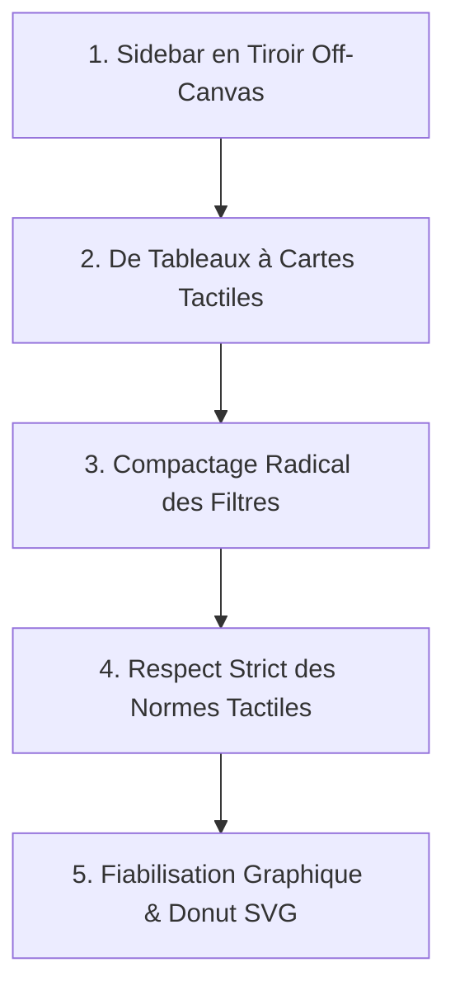

# 📘 Guide Complet de l'Architecture CSS & Ergonomie Mobile — AeroPub

Ce document détaille l'organisation complète du système de styles (CSS) de la plateforme **AeroPub**, la correspondance entre chaque fichier de style et son composant d'interface, ainsi que le déroulement complet de la transformation **Mobile-First** réalisée pour garantir un confort d'utilisation optimal sur smartphone et tablette.

---

## 🗺️ 1. Cartographie des Fichiers CSS (Quel fichier gère quoi ?)

Le projet combine du **CSS Global** (pour le design system, les thèmes et les utilitaires partagés), du **CSS de Composants Partagés** (pour la navigation et les fenêtres modales) et des **CSS Modules** (scopés localement pour éviter tout conflit de nommage).

| Fichier CSS | Type de Portée | Composants / Pages Ciblés | Responsabilités Principales |
| :--- | :--- | :--- | :--- |
| **`src/index.css`** | **Global** | **Toute l'application** (`App.jsx`, `Header.jsx`, `KpiStatsPage.jsx`, `DashboardPage.jsx`, etc.) | • Tokens de design (Bleu Royal `#2563eb`, Jaune Poussin `#facc15`, surfaces en verre) • Thème Sombre & Thème Clair (`[data-theme="light"]`) • Mise en page globale (`.app-container`, `.app-main-wrapper`) • Barre d'en-tête responsive (`.header-glass`, `.mobile-hamburger-btn`) • Bouton flottant mobile (`.mobile-fab-sidebar-btn`) • Bannière haute dynamique (`.hero-container`) • Grilles modulaires KPI (`.kpi-operations-grid`, `.kpi-analytics-grid`, `.kpi-page-container`) • Breakpoints globaux (`max-width: 768px`, `max-width: 480px`) |
| **`src/components/Sidebar.css`** | Composant | **`Sidebar.jsx`** (Menu de navigation latéral) | • Barre latérale desktop fixe (270px) et mode réduit replié (78px) • Tiroir mobile **Off-Canvas** escamotable (`transform: translateX(-100%)` vers `.mobile-open`) • Voile d'ombrage flou au toucher (`.sidebar-mobile-backdrop`) • Bouton de fermeture tactile $44\times44\text{px}$ (`.sidebar-mobile-close-btn`) • Accordéon de la poche CRUD et micro-animations |
| **`src/components/ClientModal.css`** | Composant / Onglets | **`ClientSubscriptionsModal.jsx`**, **`ClientsTab.jsx`**, **`TypeSupportsTab.jsx`**, **`ZonesTab.jsx`**, **`CategoriesTab.jsx`**, **`FormatsTab.jsx`**, **`ActionsCommercialesTab.jsx`** | • Styles de fenêtres modales (`.cm-overlay`, `.cm-modal-box`) • Barre de filtres générique (`.ts-filters-bar`, `.ts-filter-group`, `.ts-filter-select`) • Basculement responsive en grille compacte 2 colonnes sur mobile • Tableaux secondaires et badges de statut |
| **`src/pages/dashboard/tabs/AbonnementsTab.module.css`** | CSS Module (Scopé) | **`AbonnementsTab.jsx`** (Gestion des contrats d'affichage) | • Affichage conditionnel : Table desktop (`.desktopTableWrapper`) vs Cartes mobiles (`.mobileCardsContainer`) • Carte individuelle (`.aboCard`) avec bordure latérale d'alerte (Jaune J-30, Rouge échu, Bleu actif) • En-tête groupé Prix + Commercial (`.cardGlobalHeaderInfo`) • Bouton d'action principal tactile $48\text{px}$ pleine largeur (`.cardActionBtn`) • Barre d'outils mobile compacte (`.mobileToolbar`) • Modale tiroir plein écran des filtres avancés (`.mobileFilterModalOverlay`) |
| **`src/pages/dashboard/tabs/EmplacementsTab.module.css`** | CSS Module (Scopé) | **`EmplacementsTab.jsx`** (Gestion des faces publicitaires) | • Flux de cartes tactiles inspiré de Facebook pour smartphone (`.empCard`) • Bordure supérieure colorée selon l'état d'occupation • Badges dimensionnels, localisation aéroportuaire et zone • Bouton d'action $48\text{px}$ pleine largeur (`.empCardActionBtn`) • Modale de filtrage mobile plein écran |
| **`src/pages/LoginPage.module.css`** | CSS Module (Scopé) | **`LoginPage.jsx`** (Écran de connexion) | • Arrière-plan bleu nuit étoilé avec reflets • Carte de connexion verre acrylique (glassmorphism) • Formulaire ergonomique (inputs $\ge 16\text{px}$ anti-zoom, boutons tactiles) |
| **`src/pages/planning/modals/ChangeEmplacementModal.css`** | Composant | **`ChangeEmplacementModal.jsx`** (Transfert de support) | • Vue comparatrice avant/après entre deux zones • Adaptation sur une seule colonne fluide sur mobile portrait |
| **`src/components/NotificationBell.css`** | Composant | **`NotificationBell.jsx`** (Cloche des notifications) | • Dropdown tactile des alertes systèmes avec scroll fluide |
| **`src/components/DiscreetBanner.css`** | Composant | **`DiscreetBanner.jsx`** (Notifications discrètes) | • Bandeau flottant auto-escamotable de succès et erreurs |

---

## 🎨 2. Design System & Tokens Visuels (Thème Nuit & Jour)

Tous les composants s'appuient sur des variables CSS déclarées dans `src/index.css` sous `:root` (Mode Nuit par défaut) et surchargées sous `[data-theme="light"]` (Mode Jour anti-éblouissement).

### Palette Principale
* **Bleu Professionnel Royal (`--accent-primary: #2563eb`)** : Couleur dominante corporate, appliquée aux boutons principaux, icônes clés et indicateurs majeurs.
* **Jaune Poussin Lumineux (`--accent-secondary: #facc15`)** : Couleur d'accentuation haute visibilité, utilisée pour attirer immédiatement l'attention sur les urgences (échéances à J-30, pastilles de notification, statuts à relancer).
* **Surfaces de Verre Dépoli (`--bg-card`)** :
  * *Dark Mode* : `rgba(15, 23, 42, 0.75)` avec `backdrop-filter: blur(16px)` pour une atmosphère moderne type cockpit d'avion.
  * *Light Mode* : `#f8fafc` (albâtre très doux) avec bordures grises discrètes pour reposer les yeux sans éblouir.

---

## 🚀 3. Rétrospective & Déroulement : Comment nous avons transformé l'application

### A. Le Problème Initial Constaté
1. **Sidebar invasive** : Sur petit écran, la barre latérale occupait 100% de la largeur ou chevauchait le contenu, rendant la page invisible.
2. **Tableaux inexploitables (`<table>`)** : Les tables relationnelles (10 colonnes) étaient illisibles, provoquant un scroll horizontal chaotique ou des textes coupés.
3. **Syndrome des filtres envahissants** : Les en-têtes et les 6 menus déroulants de filtrage empilés prenaient **plus de 450px de hauteur**, forçant l'utilisateur à scroller longuement vers le bas avant de voir un seul contrat.
4. **Bugs des widgets KPI sous Firefox** : La rotation SVG sur le donut provoquait sa disparition complète dans Gecko, les caractères mal encodés s'affichaient avec des symboles `‚`, et les éléments blancs devenaient invisibles en mode jour.

---

### B. Les 5 Étapes Majeures de la Transformation

#### Étape 1 : La Sidebar en Tiroir Off-Canvas Escamotable
* **Le mécanisme** (`src/components/Sidebar.css` & `src/App.jsx`) :
  * Sur écran $\le 768\text{px}$, la barre latérale quitte le flux du document et devient un tiroir masqué à gauche (`position: fixed; transform: translateX(-100%)`).
  * Lorsque l'utilisateur ouvre le menu, la classe `.mobile-open` applique `transform: translateX(0)`.
  * Un voile flouté (`.sidebar-mobile-backdrop`) recouvre l'arrière-plan.
* **Le double accès ergonomique** :
  * **Header** : Un bouton tactile carré $44\times44\text{px}$ bleu royal avec icône et libellé **« Menu »** placé en haut à gauche.
  * **Bouton Flottant au Pouce (FAB)** : Un bouton flottant fixe en bas à gauche (`.mobile-fab-sidebar-btn`, hauteur $48\text{px}$, `z-index: 99990`) accessible à 1 tap du pouce lors du défilement.
  * **Fermeture instantanée** : Bouton `✕` de $44\times44\text{px}$ et fermeture automatique dès qu'un lien de menu est touché.

#### Étape 2 : De Tableaux Classiques à Flux de Cartes Mobiles
* **Suppression du `<table>` sur smartphone** :
  * Dans `AbonnementsTab.module.css` et `EmplacementsTab.module.css`, la classe `.desktopTableWrapper` est passée en `display: none !important` en dessous de $768\text{px}$.
  * La classe `.mobileCardsContainer` s'active en `display: flex; flex-direction: column; gap: 1rem;`.
* **Conception des cartes métier (`.aboCard` et `.empCard`)** :
  * **Bordure latérale d'alerte** : Une ligne gauche de $5\text{px}$ indique la santé du contrat :
    * *Jaune clignotant pulsé* (`#facc15`) pour les échéances imminentes ($\le 30$ jours).
    * *Rouge* (`#ef4444`) pour les contrats échus non renouvelés.
    * *Bleu royal* (`#2563eb`) pour les contrats actifs sains.
  * **Association visuelle Prix & Commercial** : Un bloc encadré (`.cardGlobalHeaderInfo`) lie immédiatement le montant et le gestionnaire au contrat.
  * **Bouton d'action principal pleine largeur** : Situé en bas de carte avec une hauteur de $48\text{px}$ pour être actionné d'une main sans effort.

#### Étape 3 : Compactage Radical des En-têtes & Filtres (Gain de plus de 250px)
* **Bannière d'en-tête (`src/components/HeroBanner.jsx`)** :
  * Sur smartphone ($\le 480\text{px}$), le super-badge supérieur et le sous-titre explicatif sont masqués (`display: none !important`).
  * Le titre passe à $1.05\text{rem}$ et le padding est ramené à $10\text{px}$, libérant **120px d'espace vertical**.
* **Grille de filtres 2 colonnes (`src/components/ClientModal.css`)** :
  * Dans les onglets secondaires (Clients, Types, Zones, Formats), `.ts-filters-bar` a été convertie en `grid-template-columns: 1fr 1fr`.
  * La barre de recherche prend la première ligne complète, et les 4 listes déroulantes occupent 2 lignes compactes au lieu de 4 lignes géantes.
  * Les libellés textuels superflus (`Type :`, `Statut :`) sont masqués puisque chaque sélecteur indique déjà son objet (`Tous les types`, `Toutes les zones`).
* **Barre d'outils mobile (`.mobileToolbar`)** :
  * Dans les abonnements et emplacements, la barre se résume à une ligne unique : Recherche + Bouton « Filtres » avec pastille jaune si actif.
  * Les filtres avancés s'ouvrent dans une modale dédiée plein écran (`.mobileFilterModalOverlay`), garantissant que la vue principale reste 100% dégagée.

#### Étape 4 : Application Stricte des Standards Ergonomiques Mobiles
* **Zones de clic (Touch Targets)** :
  * Taille minimale absolue garantie de **$44\times44\text{px}$** (Standard Apple iOS) ou **$48\times48\text{px}$** (Standard Google Material Design).
  * Espacement entre éléments interactifs $\ge 8\text{px}$ pour éliminer les clics accidentels (syndrome du gros doigt).
  * Hauteur des boutons de validation principaux : **$48\text{px}$ à $54\text{px}$** avec `width: 100%`.
* **Typographie & Prévention du Zoom iOS** :
  * **Champs de formulaire (`input`, `select`, `textarea`)** : Fixés strictement à **`font-size: 16px`** minimum pour empêcher le zoom automatique forcé d'iOS Safari lors du focus.
  * **Texte principal** : $16\text{px}$ ($1\text{rem}$) pour le confort de lecture.
  * **Texte secondaire** : $12\text{px}$ à $14\text{px}$ avec `line-height: 1.5`.
* **Marges & Layout** :
  * Marges latérales de l'écran : **$16\text{px}$ strict** (`padding: 0.75rem 1rem`).
  * Marges internes des cartes : **$16\text{px}$ strict** (`padding: 1rem !important`).

#### Étape 5 : Fiabilisation des Widgets KPI (`RepartitionCategoriesWidget` & `OccupationParZoneWidget`)
* **Résolution du bug SVG Firefox** :
  * Remplacement du style `transform: rotate(-90deg)` posé sur la balise `<svg>` par un élément `<g transform="rotate(-90 65 65)">`. Les coordonnées de rotation sont ainsi verrouillées au centre géométrique ($65, 65$) sur tous les moteurs de rendu (Gecko, Blink, WebKit).
  * Suppression de `strokeLinecap="round"` sur les segments courts qui générait des excroissances et recouvrait les petites catégories.
* **Adaptabilité Thème Clair / Thème Sombre** :
  * Remplacement des pistes d'arrière-plan codées en dur en blanc translucide par `var(--border-glass, rgba(148, 163, 184, 0.2))`, parfaitement visibles sur fond clair comme sur fond sombre.
* **Assainissement des caractères** :
  * Ajout d'une fonction de nettoyage `sanitizeText` corrigeant automatiquement les défauts d'encodage (ex: `Salle tapis bagage arriv‚e` devient `Salle tapis bagage arrivée`).
* **Interactivité tactile** :
  * Raccordement d'événements de clic (`onSelectCategory`, `onSelectZone`) permettant de naviguer et filtrer les données d'un simple toucher.

---

## 📐 4. Récapitulatif des Breakpoints CSS

| Breakpoint | Cible Matérielle | Comportement de l'Interface |
| :--- | :--- | :--- |
| **`> 768px`** | PC Desktop, Écrans larges, Ordinateurs portables | • Sidebar visible permanente (270px ou 78px) • Affichage exhaustif des données en tableaux relationnels (`<table>`) avec tri par colonne • Filtres en ligne horizontaux complets |
| **`max-width: 768px`** | Tablettes & Smartphones en mode paysage | • La Sidebar bascule en tiroir Off-Canvas escamotable • Les tableaux sont masqués au profit de listes de cartes tactiles • Marge latérale de sécurité fixée à 16px • Grilles KPI réduites sur 1 seule colonne |
| **`max-width: 480px`** | Smartphones en mode portrait | • Masquage du super-badge et du sous-titre de la bannière Hero • Filtres groupés en 2 colonnes fluides ou relégués en modale tiroir • Boutons d'action étendue à 100% de la largeur du pouce |

---

## 💡 5. Bonnes Pratiques pour les Futurs Développements

1. **Toujours tester avec l'inspecteur en 375px et 414px** : Tout nouveau champ de formulaire doit avoir `font-size: 16px; min-height: 44px;`.
2. **Ne jamais introduire de `<table>` sans son pendant en cartes** : Si vous créez un tableau pour le desktop, enveloppez-le dans une classe masquée sous `768px` et fournissez la version en cartes sous forme de flex vertical.
3. **Utiliser systématiquement les tokens CSS** : Ne jamais utiliser de couleur en dur (ex: `#fff`). Privilégier `var(--text-main)`, `var(--text-muted)`, `var(--accent-primary)` et `var(--border-glass)` pour préserver la cohérence entre les modes Sombre et Clair.
